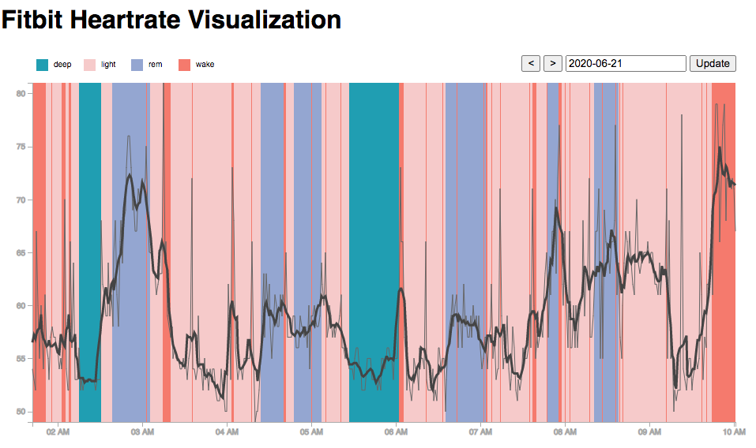

# Visualizing Heartrate together with Sleep Zones
Using D3.js and the FitBit API

Hosted by Github: https://sambe.github.io/yourgithubname.github.io/fitbit-heartrate-vis/

See below, on how to set it up, so you can use it on your own FitBit data.

## Setup

1. Clone this repo & run live-server from the console in this directory

2. Get a personal FitBit API client code:
   1. Go to https://dev.fitbit.com/apps and log in
   2. Choose the tab "REGISTER AN APP"
   3. Fill in the form:

      
      The following fields are particularly important:
      * **Callback URL**: Unfortunately Fitbit only accepts localhost for accessing intraday heart rate data
      * **OAuth 2.0 Application Type**: This needs to be "Personal" to get access to your own intraday heart rate data
      * **Default Access Type**: "Read-Only" is sufficient
   4. After saving you will get a "Client ID". Keep this one for step 3.

3. Open localhost
   1. When prompted, enter your Client ID, it will be stored in a cookie
   2. next you will get the login link on the page, click it and log in
   3. Congratulations, you should now see the visualization of your FitBit sleep and heart rate data!

Any questions? Please let me know about them in the "Issues" tab of this repo.
